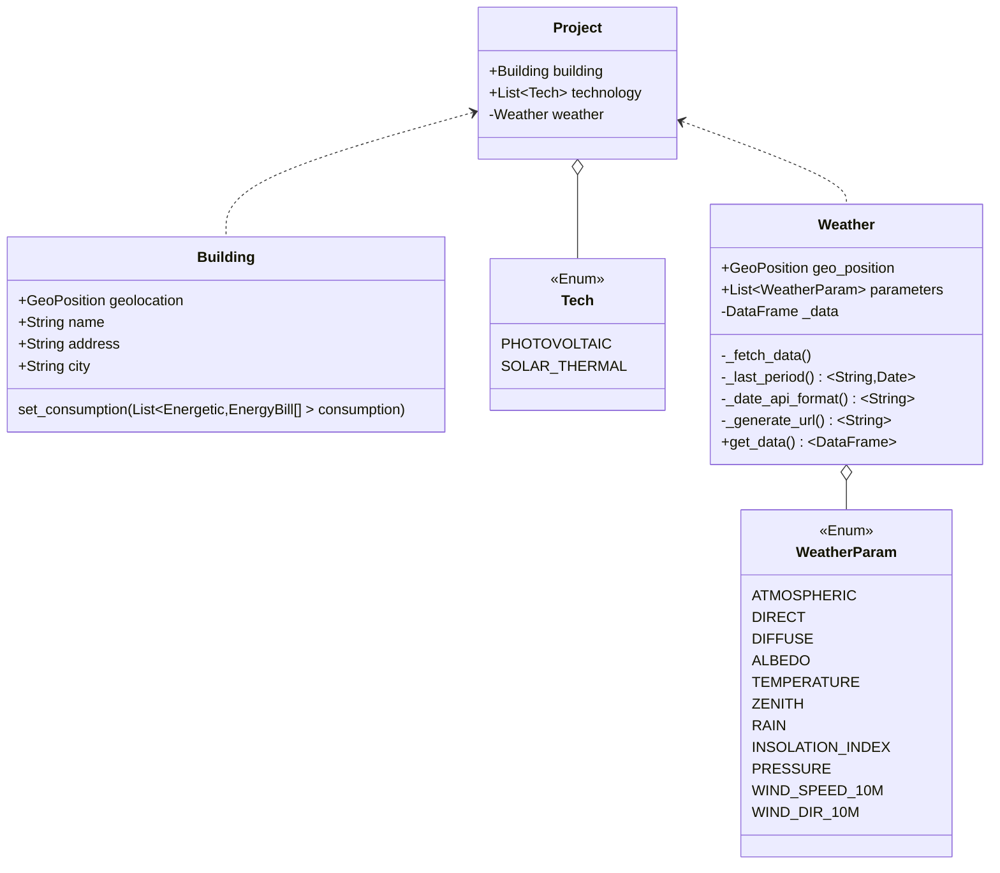

# Report gen models

```mermaid
classDiagram
    class Building{
        +GeoPosition geolocation
        +String name
        +String address
        +String city

        set_consumption(List~Energetic,EnergyBill[] ~ consumption)

    }

    class Project{
        +Building building
        +List~Tech~ technology
        -Weather weather
    }

    class Tech{
        <<Enum>>
        PHOTOVOLTAIC
        SOLAR_THERMAL
    }

    class Weather{
        +GeoPosition geo_position
        +List~WeatherParam~ parameters
        -DataFrame _data
        -_fetch_data()
        -_last_period() ~String,Date~
        -_date_api_format()~String~
        -_generate_url()~String~
        +get_data()~DataFrame~
    }

    class WeatherParam{
        <<Enum>>
        ATMOSPHERIC
        DIRECT
        DIFFUSE
        ALBEDO
        TEMPERATURE
        ZENITH
        RAIN
        INSOLATION_INDEX
        PRESSURE
        WIND_SPEED_10M
        WIND_DIR_10M
    }

    Project <.. Building
    Project o-- Tech
    Project <.. Weather

    Weather o-- WeatherParam


```
