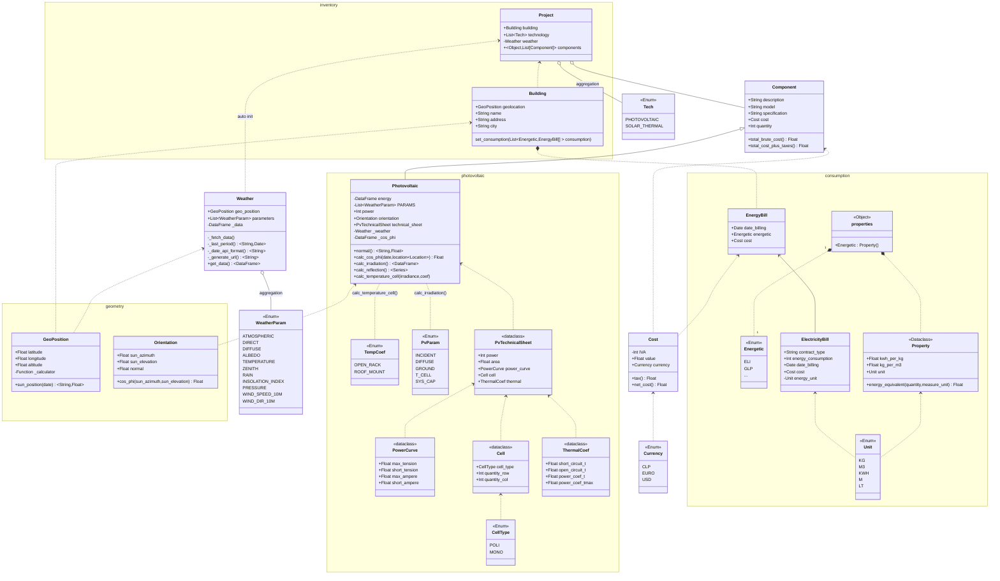

# Report gen models

```mermaid
%%{
  init: {
    'theme': 'dark',
    'themeVariables': {
      'primaryColor': '#BB2528',
      'primaryTextColor': '#fff',
      'primaryBorderColor': '#7C0000',
      'lineColor': '#fff',
      'secondaryColor': '#006100',
      'tertiaryColor': '#fafafa',
      'fontSize':'20px',
    }
  }
}%%
classDiagram

namespace inventory{

    class Building{
        +GeoPosition geolocation
        +String name
        +String address
        +String city

        set_consumption(List~Energetic,EnergyBill[] ~ consumption)

    }

    class Project{
        +Building building
        +List~Tech~ technology
        -Weather weather
        +~Object,List[Component]~ components
        }
}

    class Tech{
        <<Enum>>
        PHOTOVOLTAIC
        SOLAR_THERMAL
    }

    class Component{
        +String description
        +String model
        +String specification
        +Cost cost
        +Int quantity
        +total_brute_cost() Float
        +total_cost_plus_taxes() Float
    }

    class Cost{
        -Int IVA
        +Float value
        +Currency currency
        +tax() Float
        +net_cost() Float
    }

    class Currency{
        <<Enum>>
        CLP
        EURO
        USD
    }

    class Weather{
        +GeoPosition geo_position
        +List~WeatherParam~ parameters
        -DataFrame _data
        -_fetch_data()
        -_last_period() ~String,Date~
        -_date_api_format()~String~
        -_generate_url()~String~
        +get_data()~DataFrame~
    }

    class WeatherParam{
        <<Enum>>
        ATMOSPHERIC
        DIRECT
        DIFFUSE
        ALBEDO
        TEMPERATURE
        ZENITH
        RAIN
        INSOLATION_INDEX
        PRESSURE
        WIND_SPEED_10M
        WIND_DIR_10M
    }

namespace geometry{
    class GeoPosition{
        +Float latitude
        +Float longitude
        +Float altitude
        -Function _calculator
        +sun_position(date) ~String,Float~
    }
    class Orientation{
        +Float sun_azimuth
        +Float sun_elevation
        +Float normal
        +cos_phi(sun_azimuth,sun_elevation) Float
    }
}

namespace photovoltaic{
    class CellType{
        <<Enum>>
        POLI
        MONO
    }
    class TempCoef{
        <<Enum>>
        OPEN_RACK
        ROOF_MOUNT
    }
    class PvParam{
        <<Enum>>
        INCIDENT
        DIFFUSE
        GROUND
        T_CELL
        SYS_CAP
    }
    class PowerCurve{
        <<dataclass>>
        +Float max_tension
        +Float short_tension
        +Float max_ampere
        +Float short_ampere

    }
    class Cell{
        <<dataclass>>
        +CellType cell_type
        +Int quantity_row
        +Int quantity_col
    }
    class ThermalCoef{
        <<dataclass>>
        +Float short_circuit_t
        +Float open_circuit_t
        +Float power_coef_t
        +Float power_coef_tmax
    }
    class PvTechnicalSheet{
        <<dataclass>>
        +Int power
        +Float area
        +PowerCurve power_curve
        +Cell cell
        +ThermalCoef thermal
    }

    class Photovoltaic{
        -DataFrame energy
        -List~WeatherParam~ PARAMS
        +Int power
        +Orientation orientation
        +PvTechnicalSheet technical_sheet
        -Weather _weather
        -DataFrame _cos_phi
        +normal()~String,Float~
        +calc_cos_phi(date,location~Location~)Float
        +calc_irradiation()~DataFrame~
        +calc_reflection()~Series~
        +calc_temperature_cell(irradiance,coef)
    }
}


    Project o-- Tech : aggregation
    Project <.. Building
    Project <.. Weather : auto init
    Project o-- Component

    Weather <.. GeoPosition
    Weather o-- WeatherParam : aggregation
    Building <.. GeoPosition

    Component <.. Cost
    Cost <.. Currency
    Component <|-- Photovoltaic

    Photovoltaic <.. Orientation
    Photovoltaic <.. PvTechnicalSheet
    Photovoltaic .. TempCoef : calc_temperature_cell()
    Photovoltaic .. PvParam : calc_irradiation()


    PvTechnicalSheet <.. Cell
    Cell <.. CellType
    PvTechnicalSheet <.. PowerCurve
    PvTechnicalSheet <.. ThermalCoef


namespace consumption{
    class Energetic{
        <<Enum>>
        ELI
        GLP
        ...
    }
    class Unit{
        <<Enum>>
        KG
        M3
        KWH
        M
        LT
    }
    class Property{
        <<Dataclass>>
        +Float kwh_per_kg
        +Float kg_per_m3
        +Unit unit
        +energy_equivalent(quantity,measure_unit) Float
    }

    class properties{
        <<Object>>
        +Energetic : Property()
    }

    class EnergyBill{
        +Date date_billing
        +Energetic energetic
        +Cost cost
    }
    class ElectricityBill{
        +String contract_type
        +Int energy_consumption
        +Date date_billing
        +Cost cost
        -Unit energy_unit
    }

}
properties "1" *.. "1" Energetic
properties *.. Property
Property <.. Unit
EnergyBill <-- ElectricityBill
EnergyBill <.. Cost
ElectricityBill <.. Unit
Building *.. EnergyBill


```
